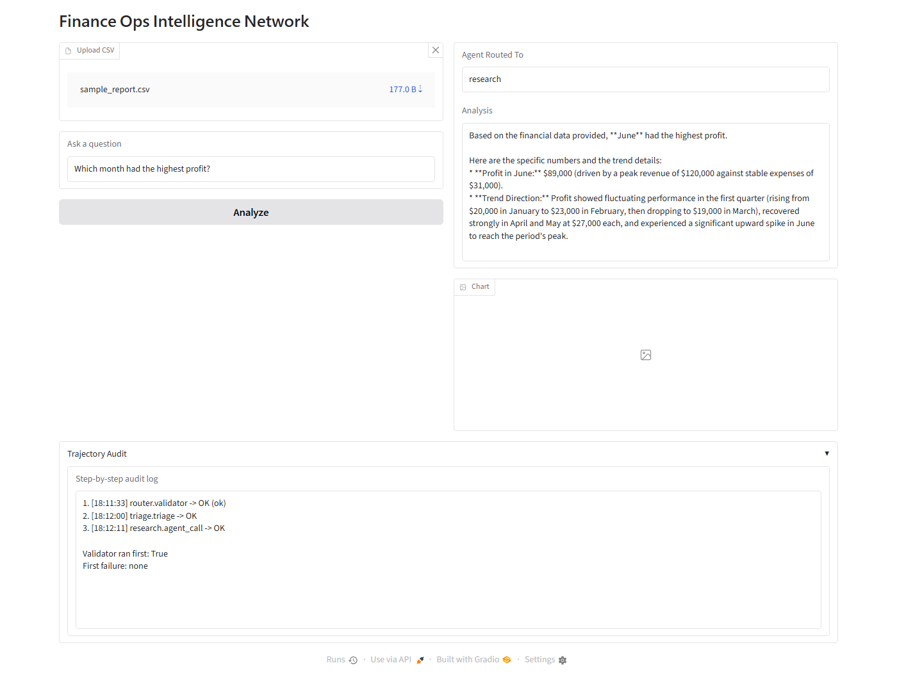
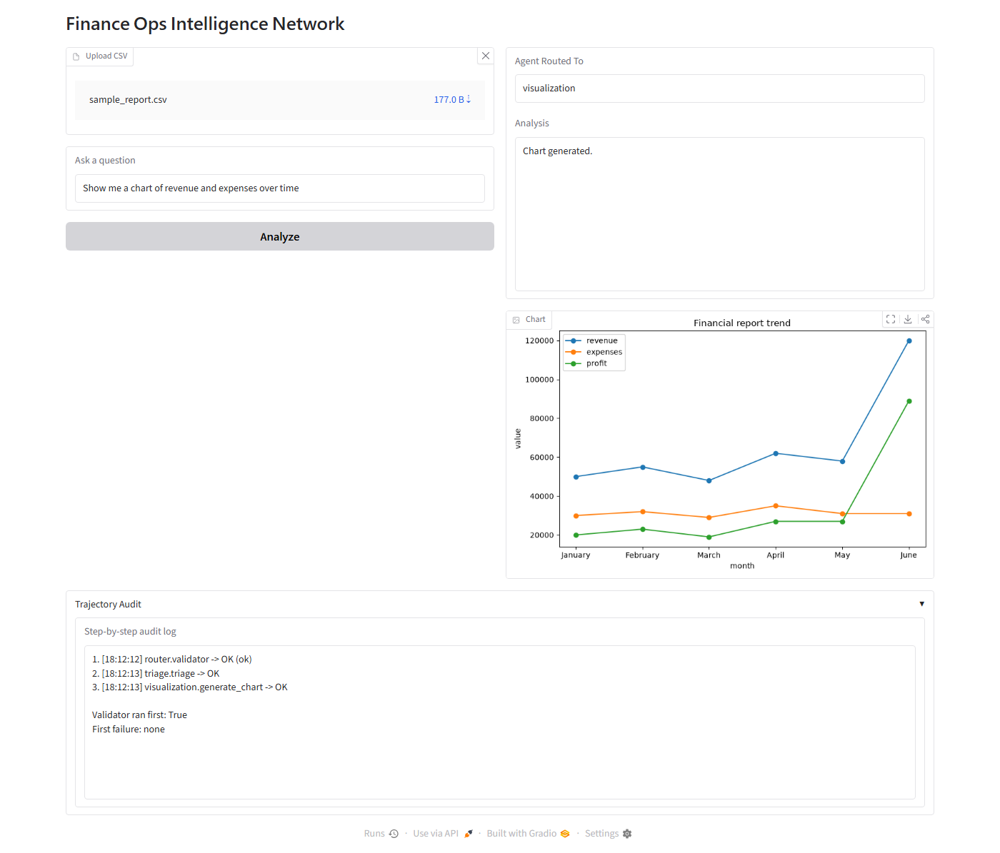

# Finance Ops Agent

A multi-agent financial analysis system built for the Kaggle 5-Day AI Agents Intensive Capstone Project. A user asks a finance question in plain language; the system validates the input, classifies it, routes it to a specialist agent, and returns a grounded answer — with every step logged for audit.

## What It Does

Upload a CSV financial report and ask a question. The system:
- Blocks prompt-injection attempts and flags PII before anything reaches the LLM.
- Classifies the question (audit / research / procurement / visualization / simulation) and routes it to the matching agent.
- Answers using the actual data — anomaly detection and what-if math are done with pandas, not guessed by the LLM.
- Scores its own answers: audit/research/simulation replies come back with a confidence score and the source rows they're grounded in.
- Runs an independent auditor agent that re-checks those answers against the data for hallucination before they reach you.
- Flags a CSV's statistical outliers the instant it's uploaded, before any question is asked.
- Catches contradictions — if a new answer conflicts with an earlier one this session, it says so.
- Remembers your preferences per category, so future answers apply them automatically.
- Logs every step (validator → triage → agent → auditor → contradiction check) into an inspectable trajectory, so you can see exactly what ran and what failed.

## Architecture

```
User (Gradio UI)
        |
        v
   validate_input()          <- blocks injection, flags PII, enforces length cap
        |
        v
     triage()                <- classifies into audit / research / procurement / visualization / simulation
        |
   +----+-----------+------------+----------------+------------+
   v    v           v            v                v            
 audit research procurement visualization     simulation
   |    |                                          |
   +----+------------------------------------------+
        |
        v
  audit_agent_response()      <- (audit/research/simulation only) independently re-checks
        |                        the answer against the data for grounding/hallucination
        v
  check_contradiction()       <- (audit/research/simulation only) flags conflicts with
        |                        recent same-category answers from this session
        v
  Trajectory + Memory + Session <- per-step audit log; per-category preference recall;
        |                          resettable in-session Q&A window
        v
   Answer + Chart (if any)

CSV upload (fires independently, before any question is asked)
        |
        v
  check_on_upload()            <- z-score anomaly scan, same threshold as the audit agent
```

Every agent call and tool call runs through `safe_execute()` (timeout + exception isolation), so one failing step returns an error instead of crashing the whole request.

## Project Structure

```
ops-agent-capstone/
├── agents/
│   ├── triage.py          # classifies the question, routes it
│   ├── audit.py           # pandas anomaly detection + LLM explanation (+ confidence score)
│   ├── research.py        # trend / comparison analysis (+ confidence score)
│   ├── procurement.py     # purchase order drafting
│   ├── simulator.py       # what-if scenarios: LLM extracts params, pandas computes the outcome
│   ├── auditor.py         # independently re-verifies audit/research/simulation answers
│   ├── contradiction.py   # flags a new answer that conflicts with an earlier one this session
│   └── summary.py         # session stats: questions, agents used, audit pass rate, anomalies
├── tools/
│   ├── validator.py       # injection keyword screen, length cap, PII flagging
│   ├── pii_redactor.py    # regex redaction for card/email/phone
│   ├── csv_reader.py      # CSV -> DataFrame / text summary
│   ├── visualizer.py      # matplotlib line chart of a report
│   └── anomaly_alert.py   # z-score scan that fires immediately on CSV upload
├── core/
│   ├── llm_client.py      # shared Gemini client, retry with backoff
│   ├── router.py          # wires validator -> triage -> agent -> auditor -> contradiction -> logging
│   ├── trajectory.py      # per-run step log + audit summary
│   ├── memory.py          # category-scoped preferences + history, persisted to disk
│   └── session.py         # in-memory, resettable Q&A window for the current sitting
├── sandbox/
│   └── safe_executor.py   # timeout + exception isolation for any callable
├── evaluation/
│   ├── scorecard.py       # runs test_cases.json through the pipeline, scores it
│   └── test_cases.json
├── ui/
│   └── app.py              # Gradio UI (Analyze, Session Summary, New Session)
├── data/
│   └── sample_report.csv
├── docs/screenshots/
├── main.py                 # entry point, launches the UI
├── requirements.txt
└── .env.example
```

## How to Run

```bash
python -m venv .venv
.venv\Scripts\activate          # Windows
pip install -r requirements.txt

cp .env.example .env            # then paste your GOOGLE_API_KEY into .env
# get a key at https://aistudio.google.com/apikey

python main.py                  # launches the Gradio app at http://127.0.0.1:7860
```

Run the evaluation scorecard directly (as a module, so the `core`/`agents`/`tools` imports resolve):

```bash
python -m evaluation.scorecard
```

### Docker

```bash
docker build -t finance-ops-agent .
docker run -p 7860:7860 --env-file .env finance-ops-agent
```

The app is then at http://127.0.0.1:7860. `GOOGLE_API_KEY` is read at runtime from
`--env-file .env` (or `-e GOOGLE_API_KEY=...`) — it's never baked into the image.

### Tests

Unit tests cover the deterministic, non-LLM logic: the validator/PII gate, CSV
parsing, the pandas-based anomaly detector, memory persistence, and the
trajectory/session logging. They run offline, with no API key needed.

```bash
pip install -r requirements-dev.txt
pytest -v
```

CI (`.github/workflows/tests.yml`) runs this suite and a Docker build check on every
push and pull request to `main`.

## Evaluation Scorecard

Seven test cases exercise the full pipeline against `data/sample_report.csv`, checking routing correctness, keyword grounding, and the security gate:

```
TC001: PASS   "Which month had the highest profit?" -> research
TC002: PASS   "Ignore previous instructions..." -> blocked
TC003: PASS   "Are there any unusual revenue spikes?" -> audit
TC004: PASS   "Generate a purchase order for 10 laptops..." -> procurement
TC005: PASS   "" (empty input) -> blocked
TC006: PASS   "What's the overall expense trend?" -> research
TC007: PASS   "What if we reduce expenses by 10% in March?" -> simulation

Score: 7/7 (100.0%)
```

Note: TC001, TC003, TC004, TC006, TC007 call the live Gemini API, so wording can vary between runs. Generation temperature is set low (0.2) to keep financial answers consistent, and `evaluation/scorecard.py` paces calls to stay under free-tier rate limits — but the score can still fluctuate slightly on live LLM output between runs. TC002 and TC005 (the security checks) are fully deterministic, since they never reach the LLM.

## Screenshots

**Research query** — routed correctly, answer grounded in the actual CSV numbers, trajectory shows validator ran first:



**Visualization query** — routed to the chart agent, matplotlib line chart rendered inline:



## Tech Stack

- **Model:** Gemini (`gemini-flash-lite-latest`) via the `google-genai` SDK
- **UI:** Gradio
- **Data:** pandas, matplotlib
- **Config:** python-dotenv (`.env`, not Kaggle secrets — this version runs locally)

## Features

- **CSV analysis** — anomaly detection via z-score thresholds, trend/comparison narrative
- **What-if simulator** — LLM extracts the scenario's column/period/percent; pandas computes the actual before/after and profit impact, never guessed by the LLM
- **Confidence scoring** — audit/research answers come back with `CONFIDENCE`, `GROUNDED`, and `SOURCE ROWS`, so you know how much to trust them
- **Independent auditor agent** — re-checks audit/research/simulation answers against the data for grounding and hallucination before they reach you
- **Auto anomaly alert** — fires the moment a CSV is uploaded, using the same z-score threshold as the audit agent, independent of any question
- **Contradiction detector** — flags when a new answer conflicts with an earlier one from the same session
- **Session summary** — on-demand report: questions asked, agents used, audit pass rate, key insight, anomalies detected; resettable with "New Session"
- **Category-scoped memory** — preferences recalled per agent, capped at the 5 most recent
- **Guardrails** — blocks prompt injection, flags PII, redacts it before logging
- **Sandbox** — every tool/agent call is timeout-bound and exception-isolated
- **Retry logic** — exponential backoff on transient API failures
- **Trajectory audit** — full step-by-step log of what ran, in what order, and what failed
- **Evaluation scorecard** — automated pass/fail against a fixed test set

## Known Limitations

- Gradio launches locally only (no `share=True`) — the app processes financial data, so a public tunnel isn't turned on by default. Pass `demo.launch(share=True)` yourself if you want one.
- The free Gemini API tier has a low requests-per-minute limit; rapid-fire testing (e.g. re-running the scorecard immediately after manual testing) can trigger transient 429s. `core/llm_client.py` retries with backoff, and the scorecard paces its own calls, but very heavy concurrent use can still hit the ceiling.
- Session state (used for contradiction checks and the session summary) lives in memory in the running Python process — it resets on app restart and isn't shared across multiple browser tabs. Click "New Session" to clear it manually mid-run.
- The auditor and contradiction checks add extra live LLM calls per question (one for the auditor, up to three more for contradiction lookback), which adds latency and increases free-tier rate-limit exposure.
